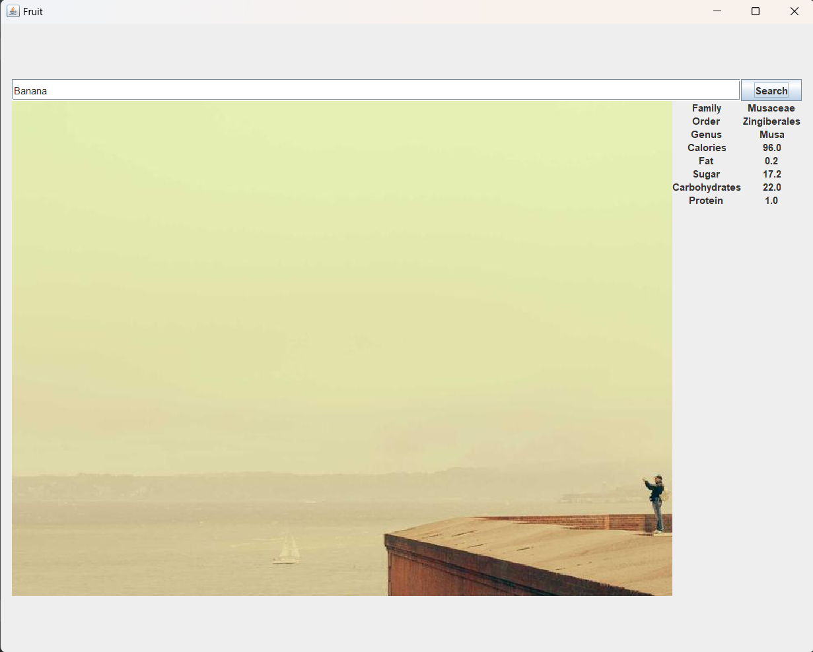

### Fruit Information Generator

Program to display image of and information about a fruit entered by user.
The information is accessed through the internet, using the Fruityvice api.
The image generated does not yet match the fruit or respond to changing input; I am still working on that part.
### Screenshots

#### Links

- [FruityVice](https://www.fruityvice.com/)
- [RxJava](https://reactivex.io/)
- [Retrofit](https://square.github.io/retrofit/)